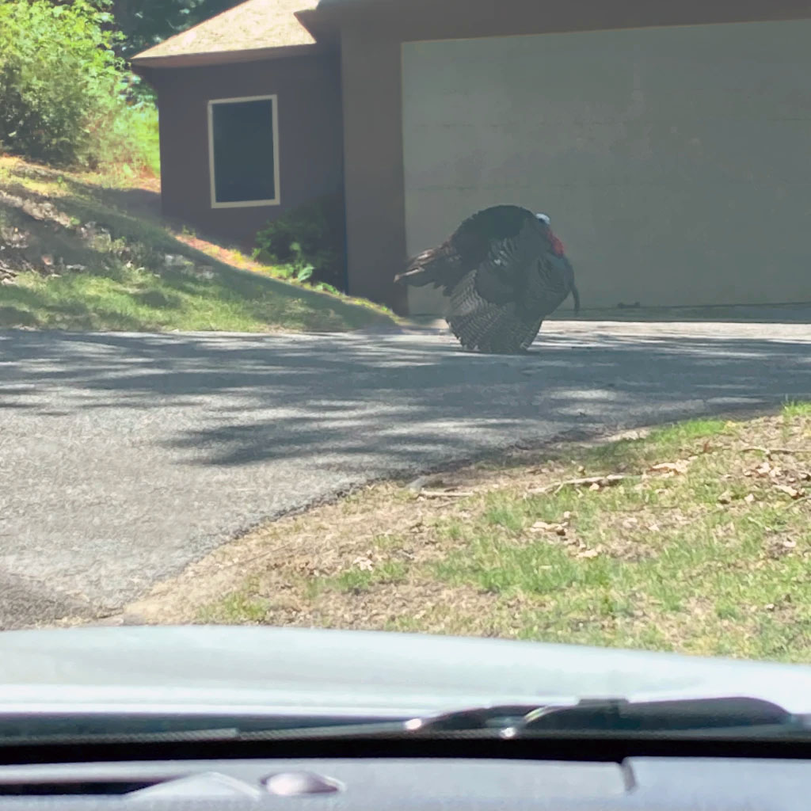
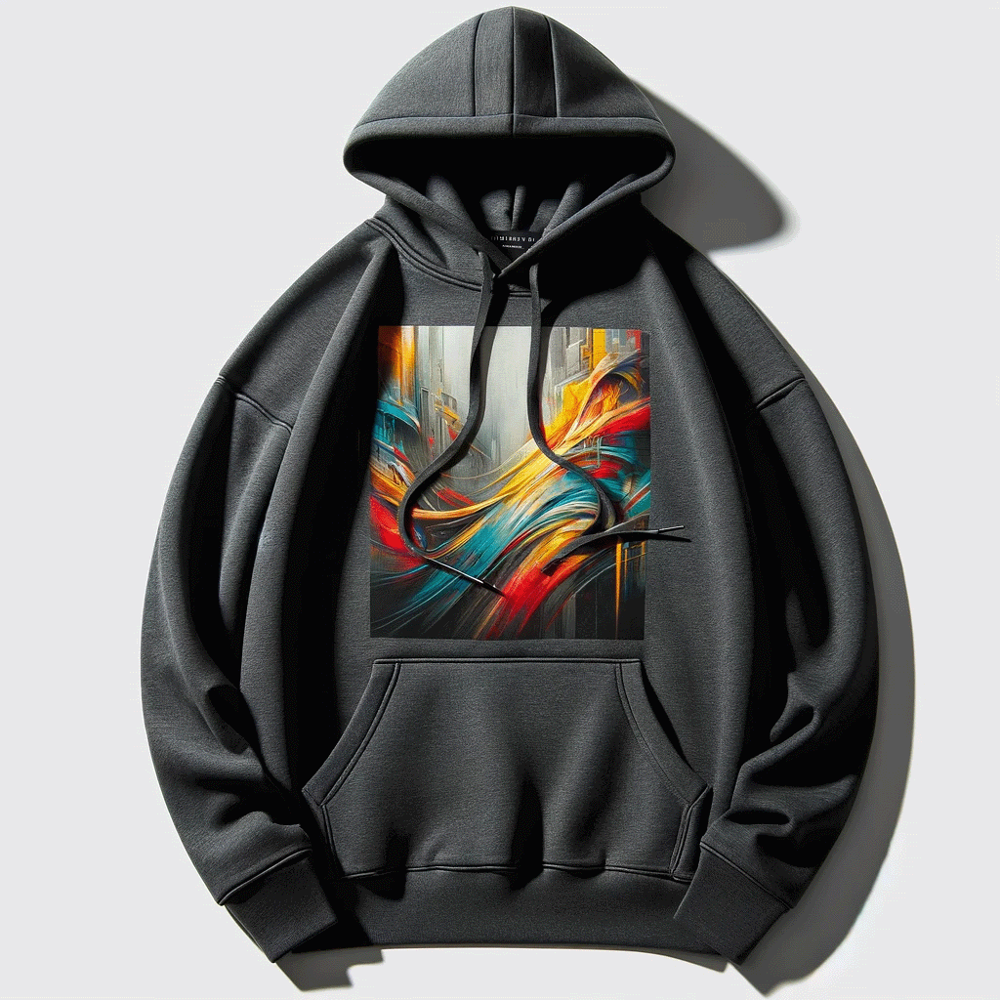
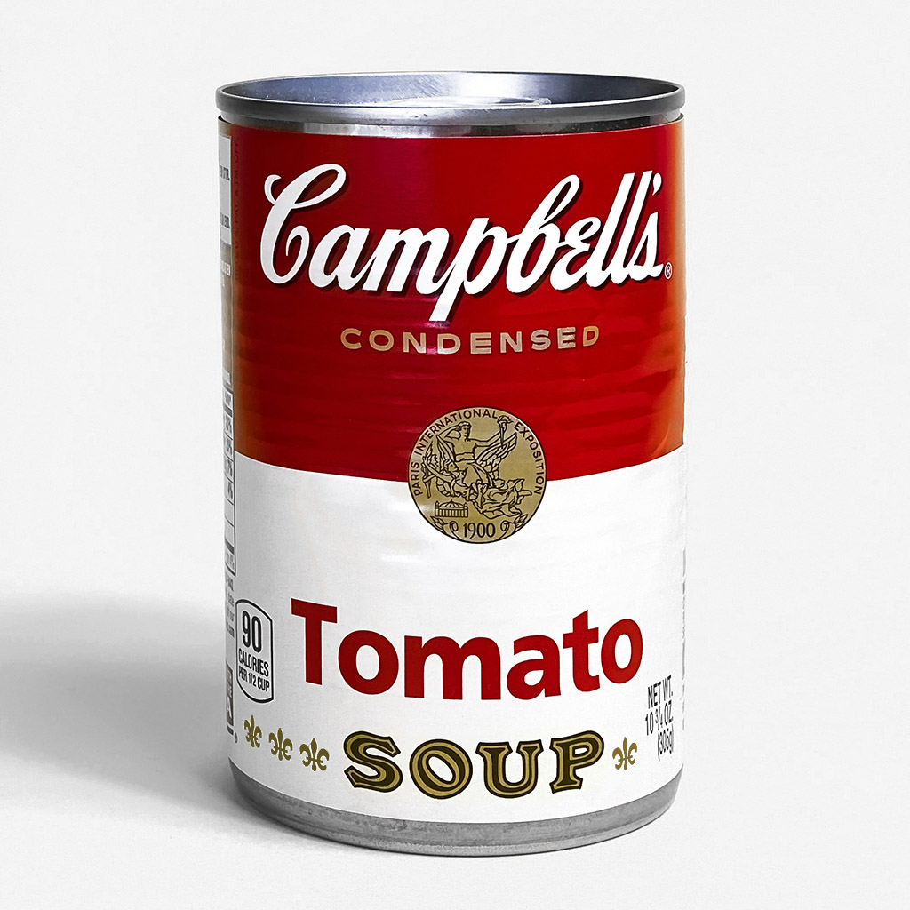
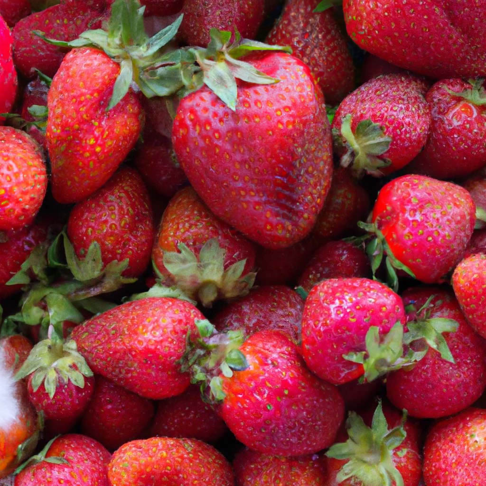
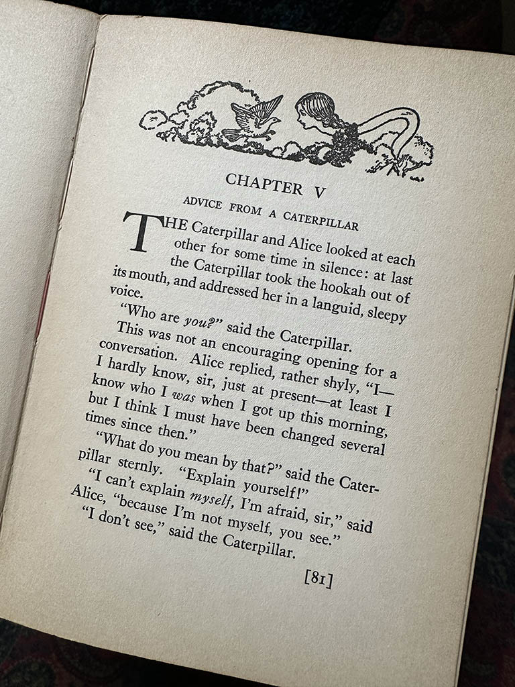

# GPT-4V Demos

<a href="https://www.python.org/downloads/"></a>
<a href="https://gpt-4v-test.streamlit.app/"></a>
<a href="https://codespaces.new/logicalroot/gpt-4v-demos?quickstart=1"></a>

This mobile-friendly web app provides some basic demos to test the vision capabilities of GPT-4V.

[Streamlit](https://streamlit.io) was selected as a framework for this project to enable rapid prototyping of new ideas.

## Examples

<table>
  <tr><td>📷 Camera</td><td>Take a photo with your device's camera and generate a caption.</td></tr>
  <tr>
    <td colspan="2">
      
      <code>An unexpected traveler struts confidently across the asphalt, its iridescent feathers gleaming in the sunlight. This wild turkey, with its distinctive fan of tail feathers on full display, appears unfazed by the nearby human presence. A dash of wilderness encounters suburbia as the bird navigates between nature and civilization. The scene is a gentle reminder of the ever-present connection between human and animal territories.</code>
    </td>
  </tr>
  <tr><td>👕 Product Descriptions</td><td>Generate a product description for an image.</td></tr>
  <tr>
    <td colspan="2">
      
      Additional Input<br />
      <code>{ "product_attributes": { "brand_name": "Logical Root", "product_name": "Pre-generated Hoodie", "materials": "100% digital cotton" } }</code><br />
      Output<br />
      <code>{ "description": "Embrace the fusion of art and comfort with the Logical Root Pre-generated Hoodie, a masterpiece crafted from 100% digital cotton to provide unparalleled softness and durability. The hoodie comes in a classic, versatile shade of black, boasting a bold graphic print at its core that captures a whirlwind of vibrant colors in an abstract design, promising to turn heads and spark conversations. With a spacious front pocket to keep your essentials close and a snug hoodie with adjustable drawstrings for those extra chilly days, this piece is the epitome of functional fashion. The ribbed cuffs and hem ensure a perfect fit while adding to the overall sleek silhouette, making it a must-have addition to your wardrobe whether you're aiming for a casual day out or a statement-making ensemble." }</code>
    </td>
  </tr>
  <tr><td>🧾 OCR</td><td>Extract the text from an image.</td></tr>
  <tr>
    <td colspan="2">
      
      <code>The text on the can reads:</code><br />
      <code>- Campbell's®</code><br />
      <code>- CONDENSED</code><br />
      <code>- 90 CALORIES PER 1/2 CUP</code><br />
      <code>- Tomato</code><br />
      <code>- SOUP</code><br />
      <code>- NET WT. 10 3/4 OZ. (305g)</code><br />
      <code>There is also text within a gold seal that reads:</code><br />
      <code>- "PARIS INTERNATIONAL EXPOSITION 1900"</code><br />
    </td>
  </tr>
  <tr><td>📋 Quality Control</td><td>Generate a QC report for an image.</td></tr>
  <tr>
    <td colspan="2">
      
      Additional Input<br />
      <code>"issue_critical": true if inedible, "issue_category": string, "issue_description": single-paragraph string</code><br />
      Output<br />
      <code>{ "issues": [ { "issue_critical": true, "issue_category": "Contamination", "issue_description": "There is visible mold on one of the strawberries in the bottom left corner of the image, indicating spoilage and potential health risk if consumed." }, { "issue_critical": false, "issue_category": "Physical Damage", "issue_description": "Several strawberries appear to have minor physical damage, such as dents and bruises, which may affect their shelf life and aesthetic appeal but are not necessarily a health hazard." } ] }</code>
    </td>
  </tr>
  <tr><td>🗣️ Speech</td><td>Generate audio from an image using GPT-4V + OpenAI TTS.</td></tr>
  <tr>
    <td colspan="2">
      
      <a href="https://github.com/logicalroot/gpt-4v-demos/raw/main/test_results/alice.mp3">Download audio</a> | <a href="https://codepen.io/logicalroot/full/gOqQzKE">Play audio on CodePen</a>
    </td>
  </tr>
</table>

## Prerequisites

- Python 3.8+
- OpenAI API key
> [How can I access GPT-4?](https://help.openai.com/en/articles/7102672-how-can-i-access-gpt-4)

## Local setup

Here's how you can get started.

1. Clone this repository.
```
git clone https://github.com/logicalroot/gpt-4v-demos.git
cd gpt-4v-demos
```
2. Install the necessary packages:
```
pip install streamlit
```
3. Run the application:
```
streamlit run 🏠_Home.py
```
4. To remove the missing secrets warning, create a blank `secrets.toml` file in your `.streamlit` folder.

> [!TIP]
> To avoid inputting your OpenAI API key every run, you can add it to `secrets.toml` with the following line. Paste your key between the double quotes.
> ```
> OPENAI_API_KEY = "YOUR KEY"
> ```
> For safety, ensure `secrets.toml` is in your `.gitignore` file.

## Limitations

To use the camera input on iOS devices, Streamlit must be configured to use SSL. See [Streamlit docs](https://docs.streamlit.io/library/advanced-features/https-support).

## Contributing

Feel free to experiment and share new demos using the code!

## About GPT-4V

- [OpenAI announcement](https://openai.com/blog/new-models-and-developer-products-announced-at-devday)
- [OpenAI research](https://openai.com/research/gpt-4v-system-card)
- [OpenAI docs](https://platform.openai.com/docs/guides/vision)

## License

This project is licensed under the terms of the MIT license.